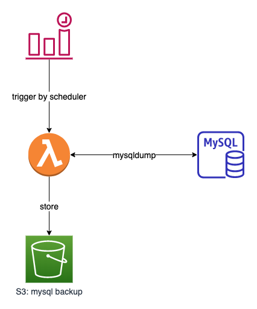
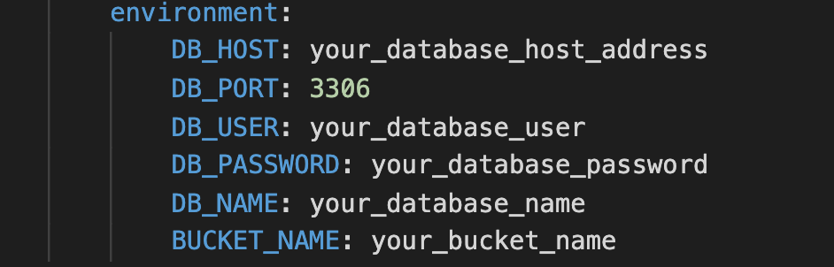

# mysql backup utility

Backup AWS RDS mysql database peroidically with automatically.

Deploy Lambda and WatchLog Schedule by Serverless framework.



## prerequisite

- for local testing
  create ".env" based on "template.env" filling with real database information.

- for AWS
  open serverless.yaml, update the **environment** section with your real database information.
  

## local test

- please make sure the "~/.aws/credentials" configured

```sh
npm install

# .env should configured with correct database connection information before executing local testing
npm run test:local
```

## configure

- the backup files expiration in days
  in serverless.yaml, change the **ExpirationInDays** under resources\Resources\Bucket\Properties\LifecycleConfiguration\Rules
- the schedule of cloud watch event
  in serverless.yaml, change the **schedule** under functions\main\events, such as rate(1 day) or rate (2 days)

## deployment

- deploy to AWS China

```sh
npm run deploy2cn
```

- deploy to AWS Global

```sh
npm run deploy
```

## issues and resolutions

- [error: database connect timeout](https://stackoverflow.com/questions/35880022/error-connect-etimedout-rds-lambda)
  
  **resolution**: In the security attached to the RDS instance, modify an inbound rule for mysql/aurora (port 3306) and rather than adding it for an IP address add it for your lambda functions security group.
- [error: S3 read-only file system](https://stackoverflow.com/questions/53810516/getting-error-aws-lambda-erofs-read-only-file-system-open-var-task-assets)

  **resolution**: save temporary file to /tmp folder in lambda.

## reference links

- [offical article: mysql database backup methods](https://dev.mysql.com/doc/refman/5.7/en/backup-methods.html)
- [Rotating database backups with node.js and S3](https://ljn.io/posts/rotating-database-backups)
- [npm - mysqldump](https://www.npmjs.com/package/mysqldump)
- [Tutorial: Schedule AWS Lambda Functions Using CloudWatch Events](https://docs.aws.amazon.com/AmazonCloudWatch/latest/events/RunLambdaSchedule.html)
- [Serverless - configure schedule](https://www.serverless.com/framework/docs/providers/aws/events/schedule/)
